# <p align="center">FIREBASE AUTHENTICATION<p>


<p align="center">
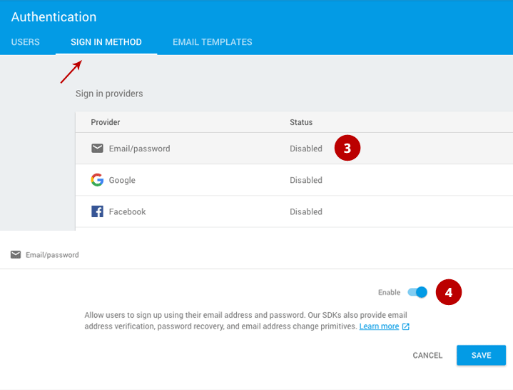

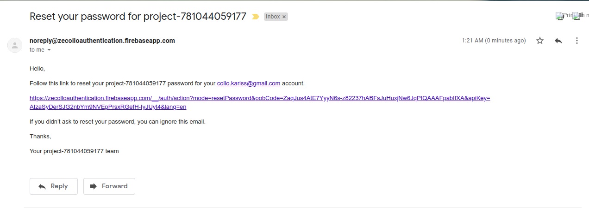
<p>


## FEATURES OF FIREBASE.


<p align="center">

<p>


Firebase comes with bunch features essential for every android app starting from **authentication** to hosting the app.


Below are the **advantages** using Firebase in general:


- Super easy and quick to implement.

- No server side configuration needed. No PHP Scripts and No Database Designs.

- Realtime update without using GCM.

- Autoscaling built-in

- Can start for free (only need to start paying once we hit 50 connections)

- Robust APIs for Javascript (including several frameworks like Angular), iOS, and Android

- Built-in support for authentication services like Facebook, Google, and Twitter

- Declarative Security Rules model allows us to enforce read/write privileges and data validation throughout the tree


## ENABLING FIREBASE AUTH


1. First thing you need to do is go to `https://firebase.google.com/` and make an account to gain access to their console. After you gain access to the console you can start by creating your first project.


<p align="center">
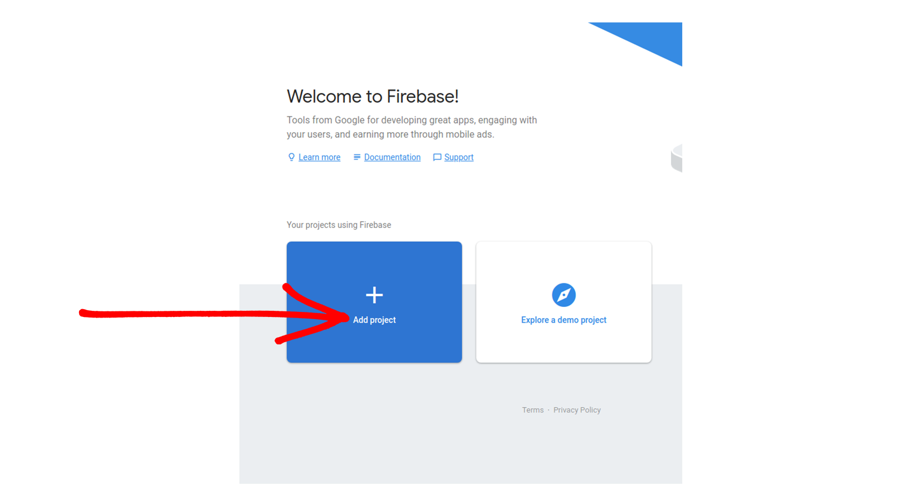
<p>


- **Give your project a name of your choice.**


<p align="center">
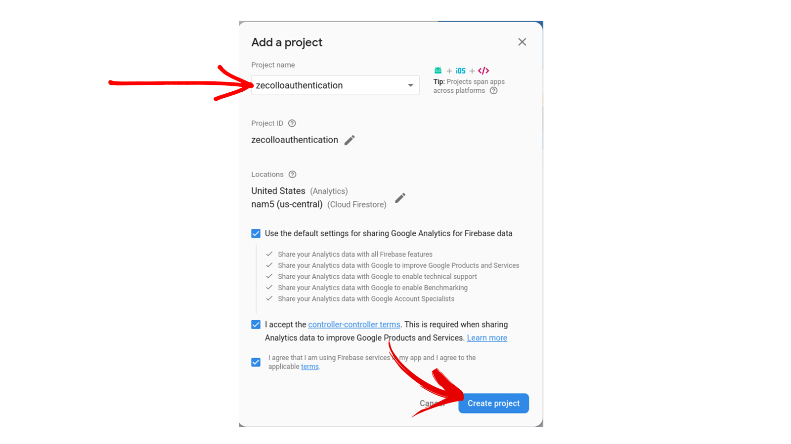
<p>


2. Next go to your project dashboard. Find the Auth and click get started. Go to set up sign in method and choose Email & Password and enable it.


<p align="center">

<p>


3. We need to now **add Firebase to our android app** so go to the project overview section and choose android.


<p align="center">

<p>


3. Give the package name of your project (mine is com.zecolloauth.zecolloauth) in which you are going to integrate the Firebase. 


<p align="center">
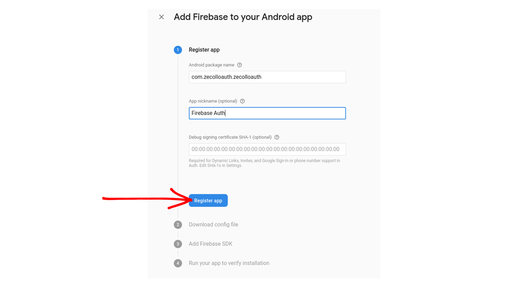
<p>


4. Here the google-services.json file will be downloaded.


<p align="center">
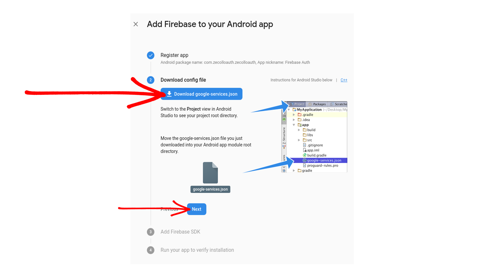
<p>


5. Switch to the Project view in Android Studio to see your project root directory. Move the **google-services.json** file you just downloaded into your Android app module `app/src/main` root directory.


<p align="center">
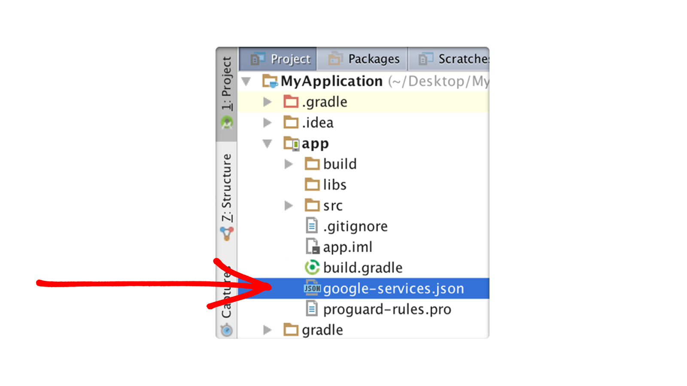
<p>


## CREATING ANDROID PROJECT


**As we work here you can compare some section of your code with my repository incase you get stuck!**


1. Create a new project in Android Studio from **File ⇒ New Project.** When it prompts you to select the default activity, select **Blank Activity** and proceed.

While filling the project details, use the same package name which you gave in firebase console. In my case I am using same **com.zecolloauth.zecolloauth**.


2. Open **AndroidManifest.xml** and add the **INTERNET** permission as we need to **make network calls** and change the theme to **NoActionBar**


#### `AndroidManifest.xml`

```xml
<uses-permission android:name="android.permission.INTERNET" />
```
#### Now change the theme to **@style/Theme.AppCompat.Light.NoActionBar**

#### `AndroidManifest.xml`


```xml
    <application
        android:theme="@style/Theme.AppCompat.Light.NoActionBar">

```


3. Confirm that you had added the **google-services.json** file to your project’s **app** folder. This step is very important as your project won’t build without this file.


4. Now open the **build.gradle** located in project’s home directory and add firebase dependency.


#### `build.gradle`

```
    dependencies {
        classpath 'com.android.tools.build:gradle:3.1.1'
        classpath 'com.google.gms:google-services:4.2.0'
        

        // NOTE: Do not place your application dependencies here; they belong
        // in the individual module build.gradle files
    }
```


5. Open **app/build.gradle** and add firebase auth dependency. At the very bottom of the file, add **apply plugin: ‘com.google.gms.google-services’**


#### `app/build.gradle`

```
dependencies {
    implementation 'com.google.firebase:firebase-auth:9.0.2'
}
 
apply plugin: 'com.google.gms.google-services'
```


6. Add the below resources to **dimens.xml, colors.xml, strings.xml and string.xml **. These resources doesn’t require for firebase, but for this demo.


#### `dimens.xml`

```xml
<resources>
    <!-- Default screen margins, per the Android Design guidelines. -->
    <dimen name="activity_horizontal_margin">16dp</dimen>
    <dimen name="activity_vertical_margin">16dp</dimen>
    <dimen name="fab_margin">16dp</dimen>
    <dimen name="logo_w_h">100dp</dimen>
</resources>
```

#### `colors.xml`

```xml
<?xml version="1.0" encoding="utf-8"?>
<resources>
    <color name="colorPrimary">#00bcd4</color>
    <color name="colorPrimaryDark">#0097a7</color>
    <color name="colorAccent">#f2fe71</color>

    <color name="white">#ffffff</color>
    <color name="colorRed">#EB3349</color>
    <color name="colorPink">#FF4081</color>
    <color name="colorTransparentPink">#FF9EA1</color>

    <color name="colorWhite">#FFFFFF</color>
    <color name="colorTransparentWhite">#cccccc</color>
    <color name="colorStandardBlack">#262626</color>
    <color name="colorDarkBlue">#001621</color>
    <color name="colorCyanBlue">#0B9BE2</color>
    <color name="colorMidBlue">#032B3F</color>
    <color name="colorCoinBackground">#01242b</color>
</resources>
```

#### `strings.xml`

```xml
<resources>
    <string name="app_name">Firebase Auth</string>
    <string name="action_sign_in_short">REGISTER</string>
    <string name="email">Email</string>
    <string name="minimum_password">Password too short, enter minimum 6 characters!</string>
    <string name="auth_failed">Authentication failed, check your email and password or sign up</string>
    <string name="change_email">Change Email</string>
    <string name="change_password">Change Password</string>
    <string name="send_password_reset_email">Send Password reset email</string>
    <string name="remove_user">Remove user</string>
    <string name="new_pass">New Password</string>
    <string name="title_activity_profile">Firebase</string>
    <string name="title_activity_login">Sign in</string>
    <string name="hint_email">Email</string>
    <string name="hint_password">Password</string>
    <string name="hint_name">Fullname</string>
    <string name="btn_login">LOGIN</string>
    <string name="btn_link_to_register">Not a member? Get registered in Firebase now!</string>
    <string name="btn_link_to_login">Already registered. Login Me!</string>
    <string name="title_activity_reset_password">ResetPasswordActivity</string>
    <string name="btn_forgot_password">Forgot your password?</string>
    <string name="btn_reset_password">RESET PASSWORD</string>
    <string name="btn_back"><![CDATA[<< Back]]></string>
    <string name="hint_new_email">New Email</string>
    <string name="btn_change">Change</string>
    <string name="btn_send">Send</string>
    <string name="btn_remove">Remove</string>
    <string name="btn_sign_out">Sign Out</string>
    <string name="lbl_forgot_password">Forgot password?</string>
    <string name="forgot_password_msg">We just need your registered Email Id to sent you password reset instructions.</string>
    <string name="settings_name">Account Settings</string>
</resources>
```

#### `styles.xml`

```xml
<resources>

    <!-- Base application theme. -->
    <style name="AppTheme" parent="Theme.AppCompat.Light.DarkActionBar">
        <item name="android:background">@color/white</item>
    </style>

    <!--Toolbar theme-->
    <style name="CustomToolbarStyle" parent="Theme.AppCompat.Light.NoActionBar">
        <item name="android:background">@color/white</item>
    </style>

    <!--Menu Item Theme-->
    <style name="CustomPopupStyle" parent="Theme.AppCompat.Light.NoActionBar">
        <item name="android:background">@color/white</item>
        <item name="overlapAnchor">false</item>
        <item name="android:dropDownVerticalOffset">-4dp</item>
    </style>

    <!--Input Theme-->
    <style name="CustomInputStyle" parent="Theme.AppCompat.Light.NoActionBar">
        <item name="android:background">@color/colorStandardBlack</item>
        <item name="android:theme">@color/colorDarkBlue</item>
    </style>

</resources>
```

7. Create a new layout file in the **drawable folder** `app/src/main/res/drawable/` named **roundbutton.xml** 

#### `roundbutton.xml`


```xml
<?xml version="1.0" encoding="utf-8"?>
<shape xmlns:android="http://schemas.android.com/apk/res/android"
    android:shape="rectangle">
    <solid android:color="@color/colorRed"/>
    <corners android:radius="150dp"/>

</shape>
```

<p align="center">

<p>


#### **Now we have the project ready with all the dependencies added. Let’s start by adding the sign up screen.**


## SIGNUP WITH EMAIL & PASSWORD.


1. Create an activity named **ResetPasswordActivity.java** and add the following code to the layout file **activity_reset_password.xml**


#### `activity_reset_password.xml`


```xml
<?xml version="1.0" encoding="utf-8"?>
<android.support.constraint.ConstraintLayout xmlns:android="http://schemas.android.com/apk/res/android"
    xmlns:app="http://schemas.android.com/apk/res-auto"
    xmlns:tools="http://schemas.android.com/tools"
    android:layout_width="match_parent"
    android:layout_height="match_parent"
    tools:context=".MainActivity">

    <TextView
        android:layout_width="wrap_content"
        android:layout_height="wrap_content"
        android:text="Everything Works Okay!"
        app:layout_constraintBottom_toBottomOf="parent"
        app:layout_constraintLeft_toLeftOf="parent"
        app:layout_constraintRight_toRightOf="parent"
        app:layout_constraintTop_toTopOf="parent" />

</android.support.constraint.ConstraintLayout>
```


2. Create an activity named **SignupActivity.java** and add the following code to the layout file **activity_signup.xml**


#### `activity_signup.xml`


```xml

<?xml version="1.0" encoding="utf-8"?>
<android.support.design.widget.CoordinatorLayout xmlns:android="http://schemas.android.com/apk/res/android"
    xmlns:app="http://schemas.android.com/apk/res-auto"
    xmlns:tools="http://schemas.android.com/tools"
    android:layout_width="match_parent"
    android:layout_height="match_parent"
    android:fitsSystemWindows="true"
    tools:context=".LoginActivity">

    <LinearLayout
        android:layout_width="fill_parent"
        android:layout_height="fill_parent"
        android:background="@color/colorWhite"
        android:gravity="center"
        android:orientation="vertical"
        android:padding="@dimen/activity_horizontal_margin">


        <ImageView
            android:layout_width="@dimen/logo_w_h"
            android:layout_height="@dimen/logo_w_h"
            android:layout_gravity="center_horizontal"
            android:layout_marginBottom="30dp"
            android:src="@drawable/knight"/>

        <android.support.design.widget.TextInputLayout
            android:layout_width="match_parent"
            android:layout_height="wrap_content"
            app:passwordToggleEnabled="true"
            android:textColorHint="@color/colorPink">

            <EditText
                android:id="@+id/email"
                android:layout_width="match_parent"
                android:layout_height="wrap_content"
                android:layout_marginBottom="10dp"
                android:hint="@string/hint_email"
                android:drawableLeft="@drawable/email"
                android:drawablePadding="10dp"
                app:fontFamily="@font/poiretoneregular"
                android:inputType="textEmailAddress"
                android:textColor="@color/colorTransparentPink"
                android:theme="@style/CustomInputStyle"/>
        </android.support.design.widget.TextInputLayout>

        <android.support.design.widget.TextInputLayout
            android:layout_width="match_parent"
            android:layout_height="wrap_content"
            app:passwordToggleEnabled="true"
            android:textColorHint="@color/colorPink">

            <EditText
                android:id="@+id/password"
                android:layout_width="match_parent"
                android:layout_height="wrap_content"
                android:layout_marginBottom="10dp"
                android:drawableLeft="@drawable/key"
                android:drawablePadding="12dp"
                android:ems="20"
                android:hint="@string/hint_password"
                app:fontFamily="@font/poiretoneregular"
                android:inputType="textPassword"
                android:textColor="@color/colorTransparentPink"
                android:theme="@style/CustomInputStyle"/>
        </android.support.design.widget.TextInputLayout>

        <!-- Login Button -->

        <Button
            android:id="@+id/btn_login"
            android:layout_width="fill_parent"
            android:layout_height="wrap_content"
            android:layout_marginTop="30dp"
            app:fontFamily="@font/josefinslabbold"
            android:background="@drawable/roundbutton"
            android:text="@string/btn_login"
            android:textColor="@color/colorTransparentWhite" />

        <Button
            android:id="@+id/btn_reset_password"
            android:layout_width="fill_parent"
            android:layout_height="wrap_content"
            android:layout_marginTop="10dp"
            android:background="@null"
            android:text="@string/btn_forgot_password"
            android:textAllCaps="false"
            app:fontFamily="@font/josefinslabitalic"
            android:textColor="@color/colorPink" />

        <!-- Link to Login Screen -->

        <Button
            android:id="@+id/btn_signup"
            android:layout_width="fill_parent"
            android:layout_height="wrap_content"
            android:layout_marginTop="10dp"
            android:background="@null"
            android:text="@string/btn_link_to_register"
            android:textAllCaps="false"
            android:textColor="@color/colorPink"
            app:fontFamily="@font/josefinslabbold"
            android:textSize="15dp"/>
    </LinearLayout>

    <ProgressBar
        android:id="@+id/progressBar"
        android:layout_width="30dp"
        android:layout_height="30dp"
        android:layout_gravity="center|bottom"
        android:layout_marginBottom="20dp"
        android:visibility="gone" />
</android.support.design.widget.CoordinatorLayout>
```


3. Open **SignupActivity.java** and add the following. Firebase provides **createUserWithEmailAndPassword()** method to create a new user with email and password data.


#### `SignupActivity.java`


```java
package com.zecolloauth.zecolloauth;

import android.content.Intent;
import android.os.Bundle;
import android.support.annotation.NonNull;
import android.support.v7.app.AppCompatActivity;
import android.text.TextUtils;
import android.view.View;
import android.widget.Button;
import android.widget.EditText;
import android.widget.ProgressBar;
import android.widget.Toast;

import com.google.android.gms.tasks.OnCompleteListener;
import com.google.android.gms.tasks.Task;
import com.google.firebase.auth.AuthResult;
import com.google.firebase.auth.FirebaseAuth;

public class SignupActivity extends AppCompatActivity {

    private EditText inputEmail, inputPassword;
    private Button btnSignIn, btnSignUp, btnResetPassword;
    private ProgressBar progressBar;
    private FirebaseAuth auth;

    @Override
    protected void onCreate(Bundle savedInstanceState) {
        super.onCreate(savedInstanceState);
        setContentView(R.layout.activity_signup);

        //Get Firebase auth instance
        auth = FirebaseAuth.getInstance();

        btnSignIn = (Button) findViewById(R.id.sign_in_button);
        btnSignUp = (Button) findViewById(R.id.sign_up_button);
        inputEmail = (EditText) findViewById(R.id.email);
        inputPassword = (EditText) findViewById(R.id.password);
        progressBar = (ProgressBar) findViewById(R.id.progressBar);
        btnResetPassword = (Button) findViewById(R.id.btn_reset_password);

        btnResetPassword.setOnClickListener(new View.OnClickListener() {
            @Override
            public void onClick(View v) {
                startActivity(new Intent(SignupActivity.this, ResetPasswordActivity.class));
            }
        });

        btnSignIn.setOnClickListener(new View.OnClickListener() {
            @Override
            public void onClick(View v) {
                finish();
            }
        });

        btnSignUp.setOnClickListener(new View.OnClickListener() {
            @Override
            public void onClick(View v) {

                String email = inputEmail.getText().toString().trim();
                String password = inputPassword.getText().toString().trim();

                if (TextUtils.isEmpty(email)) {
                    Toast.makeText(getApplicationContext(), "Enter email address!", Toast.LENGTH_SHORT).show();
                    return;
                }

                if (TextUtils.isEmpty(password)) {
                    Toast.makeText(getApplicationContext(), "Enter password!", Toast.LENGTH_SHORT).show();
                    return;
                }

                if (password.length() < 6) {
                    Toast.makeText(getApplicationContext(), "Password too short, enter minimum 6 characters!", Toast.LENGTH_SHORT).show();
                    return;
                }

                progressBar.setVisibility(View.VISIBLE);
                //create user
                auth.createUserWithEmailAndPassword(email, password)
                        .addOnCompleteListener(SignupActivity.this, new OnCompleteListener<AuthResult>() {
                            @Override
                            public void onComplete(@NonNull Task<AuthResult> task) {
                                Toast.makeText(SignupActivity.this, "createUserWithEmail:onComplete:" + task.isSuccessful(), Toast.LENGTH_SHORT).show();
                                progressBar.setVisibility(View.GONE);
                                // If sign in fails, display a message to the user. If sign in succeeds
                                // the auth state listener will be notified and logic to handle the
                                // signed in user can be handled in the listener.
                                if (!task.isSuccessful()) {
                                    Toast.makeText(SignupActivity.this, "Authentication failed." + task.getException(),
                                            Toast.LENGTH_SHORT).show();
                                } else {
                                    startActivity(new Intent(SignupActivity.this, MainActivity.class));
                                    finish();
                                }
                            }
                        });

            }
        });
    }

    @Override
    protected void onResume() {
        super.onResume();
        progressBar.setVisibility(View.GONE);
    }
}
```


4. Before we run the application confirm your **dependencies** in `app/build.gradle` are as follows.


```
dependencies {
    implementation fileTree(dir: 'libs', include: ['*.jar'])
    implementation 'com.android.support:appcompat-v7:27.0.0'
    implementation 'com.android.support:design:27.1.0'
    implementation 'com.android.support.constraint:constraint-layout:1.1.3'
    testImplementation 'junit:junit:4.12'
    androidTestImplementation 'com.android.support.test:runner:1.0.2'
    androidTestImplementation 'com.android.support.test.espresso:espresso-core:3.0.2'
    implementation 'com.google.firebase:firebase-auth:9.0.2'
}

apply plugin: 'com.google.gms.google-services'
```


5. Open AndroidManifest.xml and make SignupActivity as **launcher activity (temporarily)** and test the sign up.


<p align="center">

<p>


#### **If you login to Firebase console, you can see the user created with the email id you have given the android app.**


<p align="center">
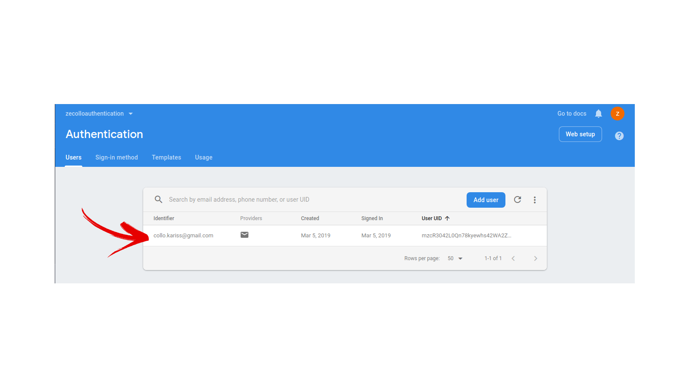
<p>


## LOGIN WITH EMAIL & PASSWORD!


#### **Now we’ll add the login screen and check the credentials we have created on sign up screen.**


1. Create another activity named **LoginActivity.java** and add the below code to its layout file **activity_login.xml.**


#### `activity_login.xml`


```xml
<?xml version="1.0" encoding="utf-8"?>
<android.support.design.widget.CoordinatorLayout xmlns:android="http://schemas.android.com/apk/res/android"
    xmlns:app="http://schemas.android.com/apk/res-auto"
    xmlns:tools="http://schemas.android.com/tools"
    android:layout_width="match_parent"
    android:layout_height="match_parent"
    android:fitsSystemWindows="true"
    tools:context=".LoginActivity">

    <LinearLayout
        android:layout_width="fill_parent"
        android:layout_height="fill_parent"
        android:background="@color/colorWhite"
        android:gravity="center"
        android:orientation="vertical"
        android:padding="@dimen/activity_horizontal_margin">


        <ImageView
            android:layout_width="@dimen/logo_w_h"
            android:layout_height="@dimen/logo_w_h"
            android:layout_gravity="center_horizontal"
            android:layout_marginBottom="30dp"
            android:src="@drawable/knight"/>

        <android.support.design.widget.TextInputLayout
            android:layout_width="match_parent"
            android:layout_height="wrap_content"
            app:passwordToggleEnabled="true"
            android:textColorHint="@color/colorPink">

            <EditText
                android:id="@+id/email"
                android:layout_width="match_parent"
                android:layout_height="wrap_content"
                android:layout_marginBottom="10dp"
                android:hint="@string/hint_email"
                android:drawableLeft="@drawable/email"
                android:drawablePadding="10dp"
                app:fontFamily="@font/poiretoneregular"
                android:inputType="textEmailAddress"
                android:textColor="@color/colorTransparentPink"
                android:theme="@style/CustomInputStyle"/>
        </android.support.design.widget.TextInputLayout>

        <android.support.design.widget.TextInputLayout
            android:layout_width="match_parent"
            android:layout_height="wrap_content"
            app:passwordToggleEnabled="true"
            android:textColorHint="@color/colorPink">

            <EditText
                android:id="@+id/password"
                android:layout_width="match_parent"
                android:layout_height="wrap_content"
                android:layout_marginBottom="10dp"
                android:drawableLeft="@drawable/key"
                android:drawablePadding="12dp"
                android:ems="20"
                android:hint="@string/hint_password"
                app:fontFamily="@font/poiretoneregular"
                android:inputType="textPassword"
                android:textColor="@color/colorTransparentPink"
                android:theme="@style/CustomInputStyle"/>
        </android.support.design.widget.TextInputLayout>

        <!-- Login Button -->

        <Button
            android:id="@+id/btn_login"
            android:layout_width="fill_parent"
            android:layout_height="wrap_content"
            android:layout_marginTop="30dp"
            app:fontFamily="@font/josefinslabbold"
            android:background="@drawable/roundbutton"
            android:text="@string/btn_login"
            android:textColor="@color/colorTransparentWhite" />

        <Button
            android:id="@+id/btn_reset_password"
            android:layout_width="fill_parent"
            android:layout_height="wrap_content"
            android:layout_marginTop="10dp"
            android:background="@null"
            android:text="@string/btn_forgot_password"
            android:textAllCaps="false"
            app:fontFamily="@font/josefinslabitalic"
            android:textColor="@color/colorPink" />

        <!-- Link to Login Screen -->

        <Button
            android:id="@+id/btn_signup"
            android:layout_width="fill_parent"
            android:layout_height="wrap_content"
            android:layout_marginTop="10dp"
            android:background="@null"
            android:text="@string/btn_link_to_register"
            android:textAllCaps="false"
            android:textColor="@color/colorPink"
            app:fontFamily="@font/josefinslabbold"
            android:textSize="15dp"/>
    </LinearLayout>

    <ProgressBar
        android:id="@+id/progressBar"
        android:layout_width="30dp"
        android:layout_height="30dp"
        android:layout_gravity="center|bottom"
        android:layout_marginBottom="20dp"
        android:visibility="gone" />
</android.support.design.widget.CoordinatorLayout>
```


2. Open **LoginActivity.java** and do the below changes. Firebase provides **signInWithEmailAndPassword()** method to sign in the user.


#### `LoginActivity.java`


```java
package com.zecolloauth.zecolloauth;

import android.content.Intent;
import android.os.Bundle;
import android.support.annotation.NonNull;
import android.support.v7.app.AppCompatActivity;
import android.support.v7.widget.Toolbar;
import android.text.TextUtils;
import android.view.View;
import android.widget.Button;
import android.widget.EditText;
import android.widget.ProgressBar;
import android.widget.Toast;
 
import com.google.android.gms.tasks.OnCompleteListener;
import com.google.android.gms.tasks.Task;
import com.google.firebase.auth.AuthResult;
import com.google.firebase.auth.FirebaseAuth;
 
public class LoginActivity extends AppCompatActivity {
 
    private EditText inputEmail, inputPassword;
    private FirebaseAuth auth;
    private ProgressBar progressBar;
    private Button btnSignup, btnLogin, btnReset;
 
    @Override
    protected void onCreate(Bundle savedInstanceState) {
        super.onCreate(savedInstanceState);
 
        //Get Firebase auth instance
        auth = FirebaseAuth.getInstance();
 
        if (auth.getCurrentUser() != null) {
            startActivity(new Intent(LoginActivity.this, MainActivity.class));
            finish();
        }
 
        // set the view now
        setContentView(R.layout.activity_login);
 
        // Toolbar toolbar = (Toolbar) findViewById(R.id.toolbar);
        // setSupportActionBar(toolbar);
 
        inputEmail = (EditText) findViewById(R.id.email);
        inputPassword = (EditText) findViewById(R.id.password);
        progressBar = (ProgressBar) findViewById(R.id.progressBar);
        btnSignup = (Button) findViewById(R.id.btn_signup);
        btnLogin = (Button) findViewById(R.id.btn_login);
        btnReset = (Button) findViewById(R.id.btn_reset_password);
 
        //Get Firebase auth instance
        auth = FirebaseAuth.getInstance();
 
        btnSignup.setOnClickListener(new View.OnClickListener() {
            @Override
            public void onClick(View v) {
                startActivity(new Intent(LoginActivity.this, SignupActivity.class));
            }
        });
 
        btnReset.setOnClickListener(new View.OnClickListener() {
            @Override
            public void onClick(View v) {
                startActivity(new Intent(LoginActivity.this, ResetPasswordActivity.class));
            }
        });
 
        btnLogin.setOnClickListener(new View.OnClickListener() {
            @Override
            public void onClick(View v) {
                String email = inputEmail.getText().toString();
                final String password = inputPassword.getText().toString();
 
                if (TextUtils.isEmpty(email)) {
                    Toast.makeText(getApplicationContext(), "Enter email address!", Toast.LENGTH_SHORT).show();
                    return;
                }
 
                if (TextUtils.isEmpty(password)) {
                    Toast.makeText(getApplicationContext(), "Enter password!", Toast.LENGTH_SHORT).show();
                    return;
                }
 
                progressBar.setVisibility(View.VISIBLE);
 
                //authenticate user
                auth.signInWithEmailAndPassword(email, password)
                        .addOnCompleteListener(LoginActivity.this, new OnCompleteListener<AuthResult>() {
                            @Override
                            public void onComplete(@NonNull Task<AuthResult> task) {
                                // If sign in fails, display a message to the user. If sign in succeeds
                                // the auth state listener will be notified and logic to handle the
                                // signed in user can be handled in the listener.
                                progressBar.setVisibility(View.GONE);
                                if (!task.isSuccessful()) {
                                    // there was an error
                                    if (password.length() < 6) {
                                        inputPassword.setError(getString(R.string.minimum_password));
                                    } else {
                                        Toast.makeText(LoginActivity.this, getString(R.string.auth_failed), Toast.LENGTH_LONG).show();
                                    }
                                } else {
                                    Intent intent = new Intent(LoginActivity.this, MainActivity.class);
                                    startActivity(intent);
                                    finish();
                                }
                            }
                        });
            }
        });
    }
}
```


3. Open **AndroidManifest.xml** and make the **LoginActivity.java** as launcher activity to make the login screen as first screen.


- Run the project and login with the credentials which you used while signing up.


<p align="center">
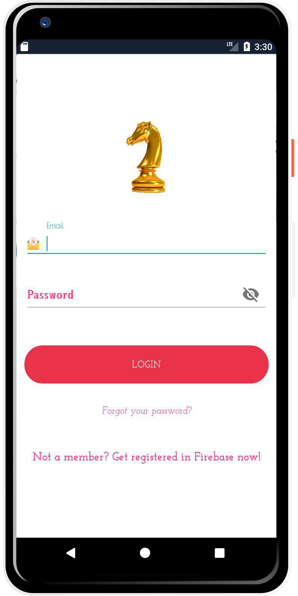
<p>


## RESET PASSWORD!


We shall try **sending reset password email** when required. This is a very difficult task if you want to have your own **email server**.


1. We had already created an activity named **ResetPasswordActivity.java** previously. Add the code below to its layout file and class.


#### `activity_reset_password.xml`


```xml
<?xml version="1.0" encoding="utf-8"?>
<android.support.design.widget.CoordinatorLayout xmlns:android="http://schemas.android.com/apk/res/android"
    xmlns:app="http://schemas.android.com/apk/res-auto"
    xmlns:tools="http://schemas.android.com/tools"
    android:layout_width="match_parent"
    android:layout_height="match_parent"
    android:layout_gravity="center"
    android:background="@color/colorTransparentWhite"
    android:fitsSystemWindows="true"
    tools:context=".ResetPasswordActivity">

    <LinearLayout
        android:layout_width="fill_parent"
        android:layout_height="wrap_content"
        android:layout_marginTop="30dp"
        android:gravity="center"
        android:orientation="vertical"
        android:padding="@dimen/activity_horizontal_margin">


        <ImageView
            android:layout_width="@dimen/logo_w_h"
            android:layout_height="@dimen/logo_w_h"
            android:layout_gravity="center_horizontal"
            android:layout_marginBottom="10dp"
            android:src="@drawable/knight" />

        <TextView
            android:layout_width="wrap_content"
            android:layout_height="wrap_content"
            android:layout_gravity="center_horizontal"
            android:padding="10dp"
            android:text="@string/lbl_forgot_password"
            android:textColor="@color/colorPink"
            app:fontFamily="@font/josefinslabbold"
            android:textSize="20dp" />

        <TextView
            android:layout_width="wrap_content"
            android:layout_height="wrap_content"
            android:layout_marginBottom="10dp"
            android:gravity="center_horizontal"
            android:padding="@dimen/activity_horizontal_margin"
            android:text="@string/forgot_password_msg"
            android:textColor="@color/colorPink"
            app:fontFamily="@font/josefinslabitalic"
            android:textSize="14dp" />

        <android.support.design.widget.TextInputLayout
            android:layout_width="match_parent"
            android:layout_height="wrap_content">

            <EditText
                android:id="@+id/email"
                android:layout_width="match_parent"
                android:layout_height="wrap_content"
                android:drawableLeft="@drawable/email"
                android:drawablePadding="10dp"
                android:layout_marginBottom="10dp"
                android:layout_marginTop="20dp"
                android:hint="@string/hint_email"
                app:fontFamily="@font/poiretoneregular"
                android:inputType="textEmailAddress"
                android:textColor="@color/colorTransparentPink"
                android:textColorHint="@android:color/white" />
        </android.support.design.widget.TextInputLayout>

        <!-- Login Button -->

        <Button
            android:id="@+id/btn_reset_password"
            android:layout_width="fill_parent"
            android:layout_height="wrap_content"
            android:layout_marginTop="30dp"
            app:fontFamily="@font/josefinslabbold"
            android:background="@drawable/roundbutton"
            android:text="@string/btn_reset_password"
            android:textColor="@color/colorTransparentWhite"  />

        <Button
            android:id="@+id/btn_back"
            android:layout_width="wrap_content"
            android:layout_height="wrap_content"
            android:layout_marginTop="10dp"
            android:background="@null"
            android:text="@string/btn_back"
            android:textColor="@color/colorPink"
            app:fontFamily="@font/josefinslabbold" />

    </LinearLayout>

    <ProgressBar
        android:id="@+id/progressBar"
        android:layout_width="30dp"
        android:layout_height="30dp"
        android:layout_gravity="center|bottom"
        android:layout_marginBottom="20dp"
        android:visibility="gone" />
</android.support.design.widget.CoordinatorLayout>
```


2. Open **ResetPasswordActivity.java** add the below code. You can use **sendPasswordResetEmail()** method to send the password reset email.


#### `ResetPasswordActivity.java`


```java
package com.zecolloauth.zecolloauth;

import android.os.Bundle;
import android.support.annotation.NonNull;
import android.support.v7.app.AppCompatActivity;
import android.text.TextUtils;
import android.view.View;
import android.widget.Button;
import android.widget.EditText;
import android.widget.ProgressBar;
import android.widget.Toast;
 
import com.google.android.gms.tasks.OnCompleteListener;
import com.google.android.gms.tasks.Task;
import com.google.firebase.auth.FirebaseAuth;
 
public class ResetPasswordActivity extends AppCompatActivity {
 
    private EditText inputEmail;
    private Button btnReset, btnBack;
    private FirebaseAuth auth;
    private ProgressBar progressBar;
 
    @Override
    protected void onCreate(Bundle savedInstanceState) {
        super.onCreate(savedInstanceState);
        setContentView(R.layout.activity_reset_password);
 
        inputEmail = (EditText) findViewById(R.id.email);
        btnReset = (Button) findViewById(R.id.btn_reset_password);
        btnBack = (Button) findViewById(R.id.btn_back);
        progressBar = (ProgressBar) findViewById(R.id.progressBar);
 
        auth = FirebaseAuth.getInstance();
 
        btnBack.setOnClickListener(new View.OnClickListener() {
            @Override
            public void onClick(View v) {
                finish();
            }
        });
 
        btnReset.setOnClickListener(new View.OnClickListener() {
            @Override
            public void onClick(View v) {
 
                String email = inputEmail.getText().toString().trim();
 
                if (TextUtils.isEmpty(email)) {
                    Toast.makeText(getApplication(), "Enter your registered email id", Toast.LENGTH_SHORT).show();
                    return;
                }
 
                progressBar.setVisibility(View.VISIBLE);
                auth.sendPasswordResetEmail(email)
                        .addOnCompleteListener(new OnCompleteListener<Void>() {
                            @Override
                            public void onComplete(@NonNull Task<Void> task) {
                                if (task.isSuccessful()) {
                                    Toast.makeText(ResetPasswordActivity.this, "We have sent you instructions to reset your password!", Toast.LENGTH_SHORT).show();
                                } else {
                                    Toast.makeText(ResetPasswordActivity.this, "Failed to send reset email!", Toast.LENGTH_SHORT).show();
                                }
 
                                progressBar.setVisibility(View.GONE);
                            }
                        });
            }
        });
    }
 
}
```


<p align="center">
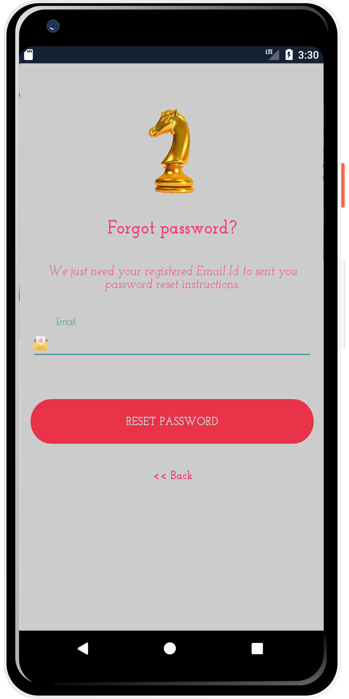
<p>


#### **Here is the password reset email user will receive.**


<p align="center">

<p>


## ADD TOOLBAR WITH ACCOUNT SETTINGS


1. Create a new layout file named **app_bar** in `app/src/main/res/layout/` and change it root element to **android.support.v7.widget.Toolbar**


<p align="center">

<p>


2. Add **custom theme** to a tool bar we shall create. 


#### `app_bar.xml`


```xml
<?xml version="1.0" encoding="utf-8"?>
<android.support.v7.widget.Toolbar xmlns:android="http://schemas.android.com/apk/res/android"
    android:layout_width="match_parent"
    android:layout_height="wrap_content"
    xmlns:app="http://schemas.android.com/apk/res-auto"
    app:theme="@style/CustomToolbarStyle"
    app:popupTheme="@style/CustomPopupStyle">
</android.support.v7.widget.Toolbar>
```


1. Create another activity named **AccountActivity.java** and add the below code to its layout file **activity_account.xml.**


#### `activity_account.xml`


```xml
<?xml version="1.0" encoding="utf-8"?>
<android.support.constraint.ConstraintLayout xmlns:android="http://schemas.android.com/apk/res/android"
    xmlns:app="http://schemas.android.com/apk/res-auto"
    xmlns:tools="http://schemas.android.com/tools"
    android:layout_width="match_parent"
    android:layout_height="match_parent"
    tools:context=".AccountActivity">

    <TextView
        android:layout_width="wrap_content"
        android:layout_height="wrap_content"
        android:text="Welcome to Accounts Department!"
        app:layout_constraintBottom_toBottomOf="parent"
        app:layout_constraintLeft_toLeftOf="parent"
        app:layout_constraintRight_toRightOf="parent"
        app:layout_constraintTop_toTopOf="parent" />

</android.support.constraint.ConstraintLayout>
```


3. In the **MainActivity class** we shall create a toolbar and menu to change to a new activity.


#### `activity_main`

```xml
<?xml version="1.0" encoding="utf-8"?>
<android.support.constraint.ConstraintLayout xmlns:android="http://schemas.android.com/apk/res/android"
    xmlns:app="http://schemas.android.com/apk/res-auto"
    xmlns:tools="http://schemas.android.com/tools"
    android:layout_width="match_parent"
    android:layout_height="match_parent"
    tools:context=".MainActivity">

    <include
        layout="@layout/app_bar"
        android:id="@+id/app_bar">
    </include>

    <TextView
        android:layout_width="wrap_content"
        android:layout_height="wrap_content"
        android:text="Hello World!"
        app:layout_constraintBottom_toBottomOf="parent"
        app:layout_constraintLeft_toLeftOf="parent"
        app:layout_constraintRight_toRightOf="parent"
        app:layout_constraintTop_toTopOf="parent" />

</android.support.constraint.ConstraintLayout>
```

#### `MainActivity.java`


```java
package com.zecolloauth.zecolloauth;

import android.content.Intent;
import android.support.v7.app.AppCompatActivity;
import android.os.Bundle;
import android.support.v7.widget.Toolbar;
import android.view.Menu;
import android.view.MenuInflater;
import android.view.MenuItem;

public class MainActivity extends AppCompatActivity {

    @Override
    protected void onCreate(Bundle savedInstanceState) {
        super.onCreate(savedInstanceState);
        setContentView(R.layout.activity_main);

        Toolbar toolbar = (Toolbar) findViewById(R.id.app_bar);
        setSupportActionBar(toolbar);
    }

    @Override
    public boolean onCreateOptionsMenu(Menu menu) {
        MenuInflater inflater = getMenuInflater();
        inflater.inflate(R.menu.menu, menu);
        return super.onCreateOptionsMenu(menu);
    }

    @Override
    public boolean onOptionsItemSelected(MenuItem item) {
        switch (item.getItemId())
        {
            case R.id.action_setting:
            //settings

                Intent settings = new Intent(this, AccountActivity.class);
                startActivity(settings);
                break;

            default:
            // select an option

        }
        return super.onOptionsItemSelected(item);
    }
}
```


4. Create another new layout file named **menu.xml** which will hold the menu widget with the account setting option.


#### `menu.xml`


```xml
<?xml version="1.0" encoding="utf-8"?>
<menu xmlns:android="http://schemas.android.com/apk/res/android"
    xmlns:app="http://schemas.android.com/apk/res-auto">
<item
    android:id="@+id/action_setting"
    android:title="@string/settings_name"
    app:showAsAction= "never">
</item>
</menu>
```


- Run the project and you will get a menu icon which contains an **Accounts Setting option**.

- Once you click on the option it will launch the **AccountsActivity**


<p align="center">


<p>


## ACCOUNT SETTING - PUT ALL TOGETHER


1. Now we’ll keep all the above functionalities in main activity and make fully functional app. Open the layout file of Account activity **activity_account.xml** and add the below layout code.


#### `activity_account.xml`


```xml
<?xml version="1.0" encoding="utf-8"?>
<android.support.design.widget.CoordinatorLayout xmlns:android="http://schemas.android.com/apk/res/android"
    xmlns:app="http://schemas.android.com/apk/res-auto"
    xmlns:tools="http://schemas.android.com/tools"
    android:layout_width="match_parent"
    android:layout_height="match_parent"
    tools:context=".AccountActivity"
    android:id="@+id/main_layout">

    <android.support.design.widget.AppBarLayout
        android:layout_width="match_parent"
        android:layout_height="wrap_content"
        app:elevation="0dp">

        <android.support.v7.widget.Toolbar
            android:id="@+id/toolbar"
            android:layout_width="match_parent"
            android:layout_height="?attr/actionBarSize"
            android:background="@color/colorPink" />

    </android.support.design.widget.AppBarLayout>

    <LinearLayout
        android:layout_width="match_parent"
        android:layout_height="wrap_content"
        android:orientation="vertical"
        android:paddingBottom="@dimen/activity_vertical_margin"
        android:paddingLeft="@dimen/activity_horizontal_margin"
        android:paddingRight="@dimen/activity_horizontal_margin"
        android:paddingTop="@dimen/activity_vertical_margin"
        app:layout_behavior="@string/appbar_scrolling_view_behavior">

        <EditText
            android:id="@+id/old_email"
            android:layout_width="match_parent"
            android:layout_height="wrap_content"
            android:hint="@string/hint_email"
            android:inputType="textEmailAddress"
            android:maxLines="1"
            android:singleLine="true" />

        <EditText
            android:id="@+id/new_email"
            android:layout_width="match_parent"
            android:layout_height="wrap_content"
            android:hint="@string/hint_new_email"
            android:inputType="textEmailAddress"
            android:maxLines="1"
            android:singleLine="true" />

        <EditText
            android:id="@+id/password"
            android:layout_width="match_parent"
            android:layout_height="wrap_content"
            android:focusableInTouchMode="true"
            android:hint="@string/hint_password"
            android:imeOptions="actionUnspecified"
            android:inputType="textPassword"
            android:maxLines="1"
            android:singleLine="true" />

        <EditText
            android:id="@+id/newPassword"
            android:layout_width="match_parent"
            android:layout_height="wrap_content"
            android:focusableInTouchMode="true"
            android:hint="@string/new_pass"
            android:imeOptions="actionUnspecified"
            android:inputType="textPassword"
            android:maxLines="1"
            android:singleLine="true" />

        <Button
            android:id="@+id/changeEmail"
            style="?android:textAppearanceSmall"
            android:layout_width="wrap_content"
            android:layout_height="wrap_content"
            android:layout_marginTop="16dp"
            android:background="@color/colorPrimaryDark"
            android:text="@string/btn_change"
            android:textColor="@android:color/white"
            android:textStyle="bold" />

        <Button
            android:id="@+id/changePass"
            style="?android:textAppearanceSmall"
            android:layout_width="wrap_content"
            android:layout_height="wrap_content"
            android:layout_marginTop="16dp"
            android:background="@color/colorPrimaryDark"
            android:text="@string/btn_change"
            android:textColor="@android:color/white"
            android:textStyle="bold" />

        <Button
            android:id="@+id/send"
            style="?android:textAppearanceSmall"
            android:layout_width="wrap_content"
            android:layout_height="wrap_content"
            android:layout_marginTop="16dp"
            android:background="@color/colorPrimaryDark"
            android:text="@string/btn_send"
            android:textColor="@android:color/white"
            android:textStyle="bold" />

        <ProgressBar
            android:id="@+id/progressBar"
            android:layout_width="30dp"
            android:layout_height="30dp"
            android:visibility="gone" />

        <Button
            android:id="@+id/remove"
            style="?android:textAppearanceSmall"
            android:layout_width="wrap_content"
            android:layout_height="wrap_content"
            android:layout_marginTop="16dp"
            android:background="@color/colorPrimaryDark"
            android:text="@string/btn_remove"
            android:textColor="@android:color/white"
            android:textStyle="bold" />

        <Button
            android:id="@+id/change_email_button"
            style="?android:textAppearanceSmall"
            android:layout_width="match_parent"
            android:layout_height="wrap_content"
            android:layout_marginTop="16dp"
            android:text="@string/change_email"
            android:textStyle="bold" />

        <Button
            android:id="@+id/change_password_button"
            style="?android:textAppearanceSmall"
            android:layout_width="match_parent"
            android:layout_height="wrap_content"
            android:layout_marginTop="16dp"
            android:text="@string/change_password"
            android:textStyle="bold" />

        <Button
            android:id="@+id/sending_pass_reset_button"
            style="?android:textAppearanceSmall"
            android:layout_width="match_parent"
            android:layout_height="wrap_content"
            android:layout_marginTop="16dp"
            android:text="@string/send_password_reset_email"
            android:textStyle="bold" />

        <Button
            android:id="@+id/remove_user_button"
            style="?android:textAppearanceSmall"
            android:layout_width="match_parent"
            android:layout_height="wrap_content"
            android:layout_marginTop="16dp"
            android:text="@string/remove_user"
            android:textStyle="bold" />

        <Button
            android:id="@+id/sign_out"
            style="?android:textAppearanceSmall"
            android:layout_width="match_parent"
            android:layout_height="wrap_content"
            android:layout_marginTop="16dp"
            android:background="@color/colorPrimary"
            android:text="@string/btn_sign_out"
            android:textColor="@android:color/white"
            android:textStyle="bold" />

    </LinearLayout>
</android.support.design.widget.CoordinatorLayout>
```


2. Open the **AccountActivity.java** and the following code. Basically here we combine all the functionalities into a single activity.


#### `AccountActivity.java`


```java
package com.zecolloauth.zecolloauth;

import android.content.Intent;
import android.os.Bundle;
import android.support.annotation.NonNull;
import android.support.v7.app.AppCompatActivity;
import android.support.v7.widget.RecyclerView;
import android.support.v7.widget.Toolbar;
import android.view.View;
import android.widget.Button;
import android.widget.EditText;
import android.widget.ProgressBar;
import android.widget.Toast;

import com.google.android.gms.tasks.OnCompleteListener;
import com.google.android.gms.tasks.Task;
import com.google.firebase.auth.FirebaseAuth;
import com.google.firebase.auth.FirebaseUser;


public class AccountActivity extends AppCompatActivity {
    public static final   String TAG = AccountActivity.class.getSimpleName();
    private Button btnChangeEmail, btnChangePassword, btnSendResetEmail, btnRemoveUser,
            changeEmail, changePassword, sendEmail, remove, signOut;
    private EditText oldEmail, newEmail, password, newPassword;
    private ProgressBar progressBar;
    private FirebaseAuth.AuthStateListener authListener;
    private FirebaseAuth auth;

    @Override
    protected void onCreate(Bundle savedInstanceState) {
        super.onCreate(savedInstanceState);
        setContentView(R.layout.activity_account);
        Toolbar toolbar = (Toolbar) findViewById(R.id.toolbar);
        toolbar.setTitle(getString(R.string.app_name));
        setSupportActionBar(toolbar);

        //get firebase auth instance
        auth = FirebaseAuth.getInstance();
        //get current user
        final FirebaseUser user = FirebaseAuth.getInstance().getCurrentUser();
        authListener = new FirebaseAuth.AuthStateListener() {
            @Override
            public void onAuthStateChanged(@NonNull FirebaseAuth firebaseAuth) {
                FirebaseUser user = firebaseAuth.getCurrentUser();
                if (user == null) {
                    startActivity(new Intent(AccountActivity.this, LoginActivity.class));
                    finish();
                }
            }
        };
        btnChangeEmail = (Button) findViewById(R.id.change_email_button);
        btnChangePassword = (Button) findViewById(R.id.change_password_button);
        btnSendResetEmail = (Button) findViewById(R.id.sending_pass_reset_button);
        btnRemoveUser = (Button) findViewById(R.id.remove_user_button);
        changeEmail = (Button) findViewById(R.id.changeEmail);
        changePassword = (Button) findViewById(R.id.changePass);
        sendEmail = (Button) findViewById(R.id.send);
        remove = (Button) findViewById(R.id.remove);
        signOut = (Button) findViewById(R.id.sign_out);

        oldEmail = (EditText) findViewById(R.id.old_email);
        newEmail = (EditText) findViewById(R.id.new_email);
        password = (EditText) findViewById(R.id.password);
        newPassword = (EditText) findViewById(R.id.newPassword);

        oldEmail.setVisibility(View.GONE);
        newEmail.setVisibility(View.GONE);
        password.setVisibility(View.GONE);
        newPassword.setVisibility(View.GONE);
        changeEmail.setVisibility(View.GONE);
        changePassword.setVisibility(View.GONE);
        sendEmail.setVisibility(View.GONE);
        remove.setVisibility(View.GONE);
        progressBar = (ProgressBar) findViewById(R.id.progressBar);
        if (progressBar != null) {
            progressBar.setVisibility(View.GONE);
        }
        btnChangeEmail.setOnClickListener(new View.OnClickListener() {
            @Override
            public void onClick(View v) {
                oldEmail.setVisibility(View.GONE);
                newEmail.setVisibility(View.VISIBLE);
                password.setVisibility(View.GONE);
                newPassword.setVisibility(View.GONE);
                changeEmail.setVisibility(View.VISIBLE);
                changePassword.setVisibility(View.GONE);
                sendEmail.setVisibility(View.GONE);
                remove.setVisibility(View.GONE);
            }
        });
        changeEmail.setOnClickListener(new View.OnClickListener() {
            @Override
            public void onClick(View v) {
                progressBar.setVisibility(View.VISIBLE);
                if (user != null && !newEmail.getText().toString().trim().equals("")) {
                    user.updateEmail(newEmail.getText().toString().trim())
                            .addOnCompleteListener(new OnCompleteListener<Void>() {
                                @Override
                                public void onComplete(@NonNull Task<Void> task) {
                                    if (task.isSuccessful()) {
                                        Toast.makeText(AccountActivity.this, "Email address is updated. Please sign in with new email!", Toast.LENGTH_LONG).show();
                                        signOut();
                                        progressBar.setVisibility(View.GONE);
                                    } else {
                                        Toast.makeText(AccountActivity.this, "Failed to update email!", Toast.LENGTH_LONG).show();
                                        progressBar.setVisibility(View.GONE);
                                    }
                                }
                            });
                } else if (newEmail.getText().toString().trim().equals("")) {
                    newEmail.setError("Enter email");
                    progressBar.setVisibility(View.GONE);
                }
            }
        });
        btnSendResetEmail.setOnClickListener(new View.OnClickListener() {
            @Override
            public void onClick(View v) {
                oldEmail.setVisibility(View.VISIBLE);
                newEmail.setVisibility(View.GONE);
                password.setVisibility(View.GONE);
                newPassword.setVisibility(View.GONE);
                changeEmail.setVisibility(View.GONE);
                changePassword.setVisibility(View.GONE);
                sendEmail.setVisibility(View.VISIBLE);
                remove.setVisibility(View.GONE);
            }
        });
        sendEmail.setOnClickListener(new View.OnClickListener() {
            @Override
            public void onClick(View v) {
                progressBar.setVisibility(View.VISIBLE);
                if (!oldEmail.getText().toString().trim().equals("")) {
                    auth.sendPasswordResetEmail(oldEmail.getText().toString().trim())
                            .addOnCompleteListener(new OnCompleteListener<Void>() {
                                @Override
                                public void onComplete(@NonNull Task<Void> task) {
                                    if (task.isSuccessful()) {
                                        Toast.makeText(AccountActivity.this, "Reset password. email is sent!", Toast.LENGTH_SHORT).show();
                                        progressBar.setVisibility(View.GONE);
                                    } else {
                                        Toast.makeText(AccountActivity.this, "Failed to send reset email!", Toast.LENGTH_SHORT).show();
                                        progressBar.setVisibility(View.GONE);
                                    }
                                }
                            });
                } else {
                    oldEmail.setError("Enter email");
                    progressBar.setVisibility(View.GONE);
                }
            }
        });

        btnRemoveUser.setOnClickListener(new View.OnClickListener() {
            @Override
            public void onClick(View v) {
                progressBar.setVisibility(View.VISIBLE);
                if (user != null) {
                    user.delete()
                            .addOnCompleteListener(new OnCompleteListener<Void>() {
                                @Override
                                public void onComplete(@NonNull Task<Void> task) {
                                    if (task.isSuccessful()) {
                                        Toast.makeText(AccountActivity.this, "Your profile is deleted:( Create a account now!", Toast.LENGTH_SHORT).show();
                                        startActivity(new Intent(AccountActivity.this, SignupActivity.class));
                                        finish();
                                        progressBar.setVisibility(View.GONE);
                                    } else {
                                        Toast.makeText(AccountActivity.this, "Failed to delete your account!", Toast.LENGTH_SHORT).show();
                                        progressBar.setVisibility(View.GONE);
                                    }
                                }
                            });
                }
            }
        });
        signOut.setOnClickListener(new View.OnClickListener() {
            @Override
            public void onClick(View v) {
                signOut();
            }
        });

    }

    //sign out method
    public void signOut() {
        auth.signOut();
    }

    @Override
    protected void onResume() {
        super.onResume();
        progressBar.setVisibility(View.GONE);
    }

    @Override
    public void onStart() {
        super.onStart();
        auth.addAuthStateListener(authListener);
    }

    @Override
    public void onStop() {
        super.onStop();
        if (authListener != null) {
            auth.removeAuthStateListener(authListener);
        }
    }
}
```


<p align="center">
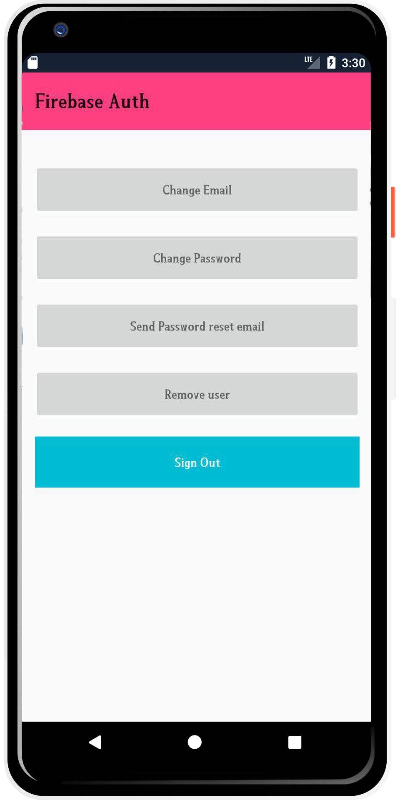
<p>


## BELOW ARE OTHER QUICK CODE SNIPPETS


### Checking User Session

```java
auth = FirebaseAuth.getInstance();
        if (auth.getCurrentUser() != null) {
            // User is logged in
        }
```


### Change Email

```java
FirebaseUser user = FirebaseAuth.getInstance().getCurrentUser();
 
user.updateEmail(newEmail.getText().toString().trim())
            .addOnCompleteListener(new OnCompleteListener<Void>() {
        @Override
        public void onComplete(@NonNull Task<Void> task) {
            if (task.isSuccessful()) {
                Toast.makeText(MainActivity.this, "Email address is updated.", Toast.LENGTH_LONG).show();
            } else {
                Toast.makeText(MainActivity.this, "Failed to update email!", Toast.LENGTH_LONG).show();
            }
        }
    });
```


### Deleting Account / User

```java
FirebaseUser user = FirebaseAuth.getInstance().getCurrentUser();
if (user != null) {
        user.delete()
                .addOnCompleteListener(new OnCompleteListener<Void>() {
                    @Override
                    public void onComplete(@NonNull Task<Void> task) {
                        if (task.isSuccessful()) {
                            Toast.makeText(MainActivity.this, "Your profile is deleted:( Create a account now!", Toast.LENGTH_SHORT).show();
                        } else {
                            Toast.makeText(MainActivity.this, "Failed to delete your account!", Toast.LENGTH_SHORT).show();
                        }
                    }
                });
    }
```


### Sign Out!

```java
auth.signOut();
 
// this listener will be called when there is change in firebase user session
FirebaseAuth.AuthStateListener authListener = new FirebaseAuth.AuthStateListener() {
            @Override
            public void onAuthStateChanged(@NonNull FirebaseAuth firebaseAuth) {
                FirebaseUser user = firebaseAuth.getCurrentUser();
                if (user == null) {
                    // user auth state is changed - user is null
                    // launch login activity
                    startActivity(new Intent(MainActivity.this, LoginActivity.class));
                    finish();
                }
            }
        };
```


#### :clap: Congratulation you have now Ingegrated Login and Register with Firebase.


Developed by
========================

- Mobile number: (+254) 798731203

- Email Address: collo.kariss@gmail.com

- github-username: [zecollokaris](https://github.com/zecollokaris)


add repo link for follow

github link and blog link